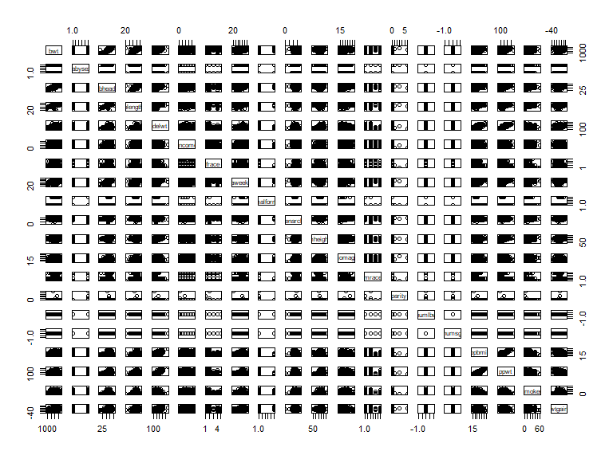
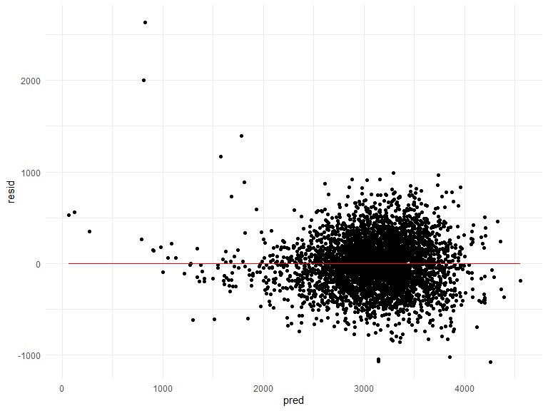
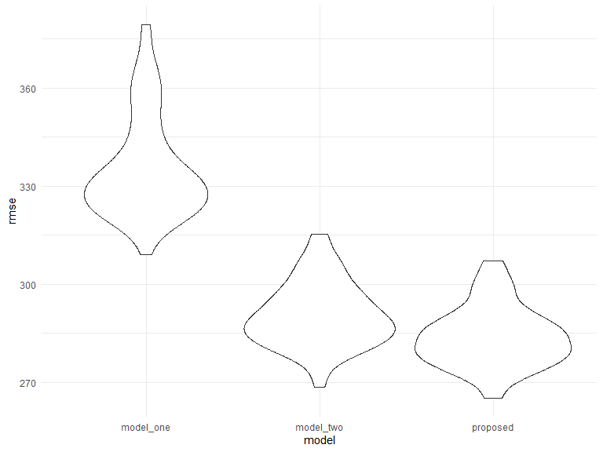
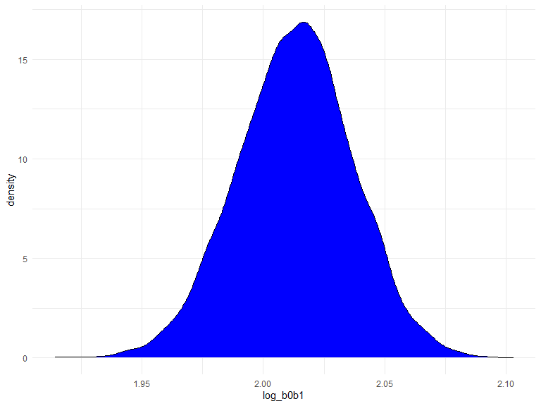
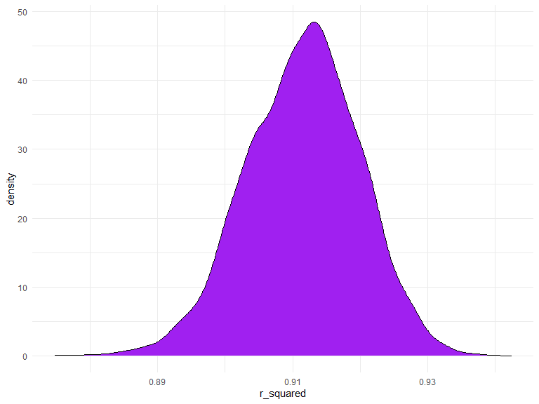

homework 6 (linear models)
================
Purnima Sharma
2020-12-08

## Problem 1

``` r
homicide_df = 
  read_csv("data/homicide-data.csv", na = c("", "NA", "Unknown")) %>% 
  mutate(
    city_state = str_c(city, state, sep = ", "),
    victim_age = as.numeric(victim_age),
    resolution = case_when(
      disposition == "Closed without arrest" ~ 0,
      disposition == "Open/No arrest"        ~ 0,
      disposition == "Closed by arrest"      ~ 1)
  ) %>% 
  filter(
    victim_race %in% c("White", "Black"),
    city_state != "Tulsa, AL") %>% 
  select(city_state, resolution, victim_age, victim_race, victim_sex)
```

    ## Parsed with column specification:
    ## cols(
    ##   uid = col_character(),
    ##   reported_date = col_double(),
    ##   victim_last = col_character(),
    ##   victim_first = col_character(),
    ##   victim_race = col_character(),
    ##   victim_age = col_double(),
    ##   victim_sex = col_character(),
    ##   city = col_character(),
    ##   state = col_character(),
    ##   lat = col_double(),
    ##   lon = col_double(),
    ##   disposition = col_character()
    ## )

Start with one city.

``` r
baltimore_df =
  homicide_df %>% 
  filter(city_state == "Baltimore, MD")
glm(resolution ~ victim_age + victim_race + victim_sex, 
    data = baltimore_df,
    family = binomial()) %>% 
  broom::tidy() %>% 
  mutate(
    OR = exp(estimate),
    CI_lower = exp(estimate - 1.96 * std.error),
    CI_upper = exp(estimate + 1.96 * std.error)
  ) %>% 
  select(term, OR, starts_with("CI")) %>% 
  knitr::kable(digits = 3)
```

| term              |    OR | CI\_lower | CI\_upper |
| :---------------- | ----: | --------: | --------: |
| (Intercept)       | 1.363 |     0.975 |     1.907 |
| victim\_age       | 0.993 |     0.987 |     1.000 |
| victim\_raceWhite | 2.320 |     1.648 |     3.268 |
| victim\_sexMale   | 0.426 |     0.325 |     0.558 |

Try this across cities.

``` r
models_results_df =
homicide_df %>% 
  nest(data = -city_state) %>% 
  mutate(
    models = 
      map(.x = data, ~glm(resolution ~ victim_age + victim_race + victim_sex, data = .x, family = binomial())),
     results = map(models, broom::tidy)
  ) %>% 
  select(city_state, results) %>% 
  unnest(results) %>% 
  mutate(
    OR = exp(estimate),
    CI_lower = exp(estimate - 1.96 * std.error),
    CI_upper = exp(estimate + 1.96 * std.error)
  ) %>% 
  select(city_state, term, OR, starts_with("CI"))
```

Make plots.

``` r
models_results_df %>% 
  filter(term == "victim_sexMale") %>% 
  mutate(city_state = fct_reorder(city_state, OR)) %>% 
  ggplot(aes(x = city_state, y = OR)) +
  geom_point() + 
  geom_errorbar(aes(ymin = CI_lower, ymax = CI_upper)) + 
  theme(axis.text.x = element_text(angle = 90, hjust = 1))
```


## Problem 2

Effects of variables on child’s birthweight.

Load and clean data

``` r
baby_df = 
  read_csv("./data/birthweight.csv") %>% 
  relocate(bwt) %>% 
  mutate(
    frace = as.factor(frace),
    babysex = as.factor(babysex),
    malform = as.factor(malform),
    mrace = as.factor(mrace)
  ) %>% 
  drop_na(bwt, blength, gaweeks, bhead, blength, babysex) 
```

    ## Parsed with column specification:
    ## cols(
    ##   .default = col_double()
    ## )

    ## See spec(...) for full column specifications.

Build regression model

``` r
# scatterplot matrix and pairwise correlations
pairs(baby_df)
```



``` r
proposed_model = lm(bwt ~ gaweeks + wtgain + bhead * blength + ppbmi * ppwt, data = baby_df)

broom::tidy(proposed_model) 
```

    ## # A tibble: 9 x 5
    ##   term            estimate std.error statistic  p.value
    ##   <chr>              <dbl>     <dbl>     <dbl>    <dbl>
    ## 1 (Intercept)   -3493.      807.        -4.33  1.53e- 5
    ## 2 gaweeks          14.5       1.50       9.68  5.99e-22
    ## 3 wtgain            3.59      0.403      8.92  6.70e-19
    ## 4 bhead            48.6      24.6        1.98  4.81e- 2
    ## 5 blength          18.3      16.8        1.09  2.78e- 1
    ## 6 ppbmi            -1.55      5.16      -0.300 7.64e- 1
    ## 7 ppwt              5.23      0.875      5.98  2.39e- 9
    ## 8 bhead:blength     1.80      0.505      3.56  3.69e- 4
    ## 9 ppbmi:ppwt       -0.0806    0.0321    -2.51  1.21e- 2

``` r
proposed_model = lm(bwt ~ gaweeks + wtgain + ppwt + bhead * blength, data = baby_df) 

broom::tidy(proposed_model)
```

    ## # A tibble: 7 x 5
    ##   term          estimate std.error statistic  p.value
    ##   <chr>            <dbl>     <dbl>     <dbl>    <dbl>
    ## 1 (Intercept)   -3208.     803.       -3.99  6.60e- 5
    ## 2 gaweeks          14.5      1.50      9.63  9.79e-22
    ## 3 wtgain            3.76     0.403     9.34  1.44e-20
    ## 4 ppwt              1.57     0.216     7.25  4.93e-13
    ## 5 bhead            44.6     24.6       1.81  7.05e- 2
    ## 6 blength          16.4     16.9       0.973 3.30e- 1
    ## 7 bhead:blength     1.88     0.507     3.72  2.03e- 4

The proposed model is built based on the outcome of scatterplot matrix
and pairwise correlations to check for significant covariates and any
interaction terms. Due to insignificant p-value at 5% significance level
of ppbmi, it is removed from the model. Gestational age in weeks,
mother’s weight gain during pregnancy (lbs), mother’s pre-pregnancy
weight (lbs), interaction between baby’s head circumference (cm) and
length (cm) at birth are retained as significant factors underlying
baby’s birthweight.

Plot of residuals against fitted values

``` r
modelr::add_residuals(baby_df, proposed_model) %>%
add_predictions(proposed_model) %>%
ggplot(aes(x = pred, y = resid)) +
  geom_point() + 
  geom_line(aes(y = 0), color = "red")
```



The residuals seem to be evenly distributed around zero for the
predicted birthweights (gm), except for some low-end outliers with
over-estimated residuals. For the most part, the cluster is around
2,000gm to 4,000gm of birthweight.

Compare models

``` r
model_one = lm(bwt ~ blength + gaweeks, data = baby_df)
broom::tidy(model_one) 
```

    ## # A tibble: 3 x 5
    ##   term        estimate std.error statistic  p.value
    ##   <chr>          <dbl>     <dbl>     <dbl>    <dbl>
    ## 1 (Intercept)  -4348.      98.0      -44.4 0.      
    ## 2 blength        129.       1.99      64.6 0.      
    ## 3 gaweeks         27.0      1.72      15.7 2.36e-54

``` r
model_two = lm(bwt ~ bhead * blength * babysex, data = baby_df)
broom::tidy(model_two) 
```

    ## # A tibble: 8 x 5
    ##   term                    estimate std.error statistic      p.value
    ##   <chr>                      <dbl>     <dbl>     <dbl>        <dbl>
    ## 1 (Intercept)            -7177.     1265.       -5.67  0.0000000149
    ## 2 bhead                    182.       38.1       4.78  0.00000184  
    ## 3 blength                  102.       26.2       3.90  0.0000992   
    ## 4 babysex2                6375.     1678.        3.80  0.000147    
    ## 5 bhead:blength             -0.554     0.780    -0.710 0.478       
    ## 6 bhead:babysex2          -198.       51.1      -3.88  0.000105    
    ## 7 blength:babysex2        -124.       35.1      -3.52  0.000429    
    ## 8 bhead:blength:babysex2     3.88      1.06      3.67  0.000245

``` r
proposed_model = lm(bwt ~ gaweeks + wtgain + ppwt + bhead * blength, data = baby_df)

# Cross-validation, 100 repetitions 
cv_df =
  crossv_mc(baby_df, 100) %>%   
  mutate(
    train = map(train, as_tibble),
    test = map(test, as_tibble))

#fit models and get prediction errors 
cv_df = 
cv_df %>%    
  mutate(
    model_one = map(.x = train, ~lm(bwt ~ blength + gaweeks, data = .x)), 
    model_two = map(.x = train, ~lm(bwt ~ bhead * blength * babysex, data = .x)),
    proposed_model = map(.x = train, ~lm(bwt ~ gaweeks + wtgain + ppwt + bhead * blength, data = .x))
  ) %>% 
  mutate(           
    rmse_model_one = map2_dbl(.x = model_one, .y = test, ~rmse(model = .x, data = .y)),
    rmse_model_two = map2_dbl(.x = model_two, .y = test, ~rmse(model = .x, data = .y)),
    rmse_proposed = map2_dbl(.x = proposed_model, .y = test, ~rmse(model = .x, data = .y))
  )
```

Plot to compare prediction errors

``` r
cv_df %>% 
  select(starts_with("rmse")) %>%    
  pivot_longer(
    everything(),   
    names_to = "model",
    values_to = "rmse",
    names_prefix = "rmse_"   
  ) %>%         
  ggplot(aes(x = model, y = rmse)) +
  geom_violin() 
```



The results show that the standard deviation of the residuals, given by
Root Mean Square Error (rmse) was the lowest in the proposed model, even
if just slightly lower than the given model 2. Clearly, there was a
great improvement in model-building from model 1 to model 2 and proposed
model.

## Problem 3

Analysis of distribution of two measures from a simple linear model
using Bootstrap.

Load data

``` r
weather_df = 
  rnoaa::meteo_pull_monitors(
    c("USW00094728"),
    var = c("PRCP", "TMIN", "TMAX"), 
    date_min = "2017-01-01",
    date_max = "2017-12-31") %>%
  mutate(
    name = recode(id, USW00094728 = "CentralPark_NY"),
    tmin = tmin / 10,
    tmax = tmax / 10) %>%
  select(name, id, everything())
```

    ## Registered S3 method overwritten by 'hoardr':
    ##   method           from
    ##   print.cache_info httr

    ## using cached file: C:\Users\arunp\AppData\Local\cache/R/noaa_ghcnd/USW00094728.dly

    ## date created (size, mb): 2020-10-03 16:57:15 (7.537)

    ## file min/max dates: 1869-01-01 / 2020-10-31

Build a simple linear regression model, set-up “measures” calculations

``` r
fit = lm(tmax ~ tmin, data = weather_df)

#get estimates (beta-0 and beta-1)

estimates_df = 
broom::tidy(fit) %>% 
  select(term, "estimate") %>% 
  pivot_wider(
    names_from = "term",
  values_from = "estimate"
  ) %>% 
janitor::clean_names() %>% 
  mutate(
    b0_hat = as.numeric(intercept),
    b1_hat = as.numeric(tmin)
  ) %>%
  select(-intercept, -tmin)

# Calculate required quantity

estimates_df =
  estimates_df %>% 
  mutate(
    log_b0b1 = log(b0_hat * b1_hat)
  )
```

Draw bootstrap samples, get measures of interest 1. log(b0 \* b1)

``` r
# create bootstrap function

boot_sample = function(df) {  
  sample_frac(df, replace = TRUE)  %>%    
    arrange(tmin) 
}

# create bootstrap samples

boot_straps = 
  tibble(                     
    strap_number = 1:5000,
    strap_sample = rerun(5000, boot_sample(weather_df))
  )

# Get bootstrap results

boot_results = 
  boot_straps %>% 
  mutate(
   models = map(.x = strap_sample, ~lm ( tmax ~ tmin, data = .x)), 
   results = map(models, broom::tidy), 
  ) %>%  
  select(strap_number, results) %>%  
  unnest(results) %>%  
  select(-std.error, -statistic, -p.value) %>% 
  group_by(term) %>% 
  pivot_wider(
    names_from = "term",
  values_from = "estimate"
  ) %>% 
janitor::clean_names() %>% 
  mutate(
    b0_hat = as.numeric(intercept),
    b1_hat = as.numeric(tmin)
  ) %>%
  select(-intercept, -tmin) %>% 
  mutate(
    log_b0b1 = log(b0_hat * b1_hat)
  )
```

Distribution Plot: log(b0 \* b1)

``` r
boot_results %>% 
  ggplot(aes(x = log_b0b1))  +
  geom_density(color = 'black', fill = 'blue') 
```



The distribution of log(b0 \* b1), using 5,000 bootstrap estimates, is
fairly symmetrical, a good representation of a normal distribution with
average value of the measure at 2.01 approximately.

Confidence interval: log(b0 \* b1)

``` r
boot_results %>% 
  summarize(
    ci_lower = quantile(log_b0b1, 0.025), 
    ci_upper = quantile(log_b0b1, 0.975)
  ) %>% 
  knitr::kable()
```

| ci\_lower | ci\_upper |
| --------: | --------: |
|  1.965345 |  2.059112 |

The 95% confidence interval for the quantity “log (b0 \* b1)” using
5,000 bootstrap estimates is (1.96, 2.06).

2.  R-squared hat

<!-- end list -->

``` r
# extract r2-hat

r2_hat_df = 
weather_df %>% 
  bootstrap(5000, id = "strap_number") %>%   
   mutate(
    models = map(.x = strap, ~lm ( tmax ~ tmin, data = .x)), 
    results = map(models, broom::glance) 
  ) %>% 
  select(strap_number, results) %>%  
  unnest(results) %>% 
 select(strap_number, "r.squared") %>% 
  janitor::clean_names()
```

Distribution Plot: r-squared hat

``` r
r2_hat_df %>% 
  ggplot(aes(x = r_squared))  +
  geom_density(color = 'black', fill = 'purple') 
```



The distribution of the coefficient of determination produced by 5,000
bootstrap estimates is a fair representation of a normal distribution,
with slight left-skewness, suggesting that simple linear regression
might not be an ideal model for the data. The average value of the
measure is 0.91 approximately.

Confidence interval: r-squared hat

``` r
r2_hat_df  %>% 
  summarize(
    ci_lower = quantile(r_squared, 0.025), 
    ci_upper = quantile(r_squared, 0.975)
  ) %>% 
  knitr::kable()
```

| ci\_lower | ci\_upper |
| --------: | --------: |
| 0.8943297 | 0.9273781 |

The 95% confidence interval for the coefficient of determination using
5,000 bootstrap estimates is (0.893, 0.927).

-----
